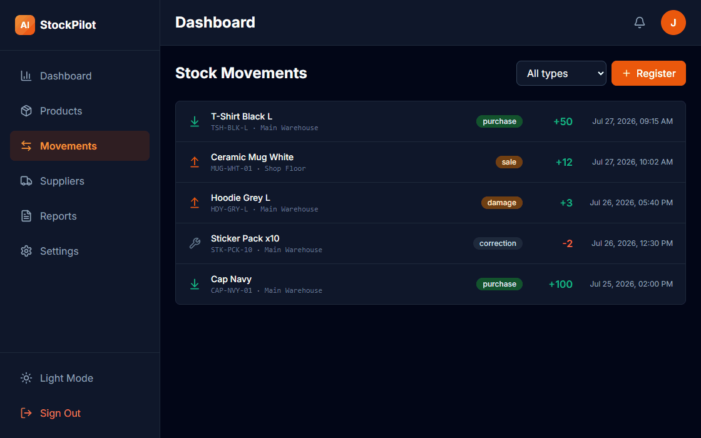
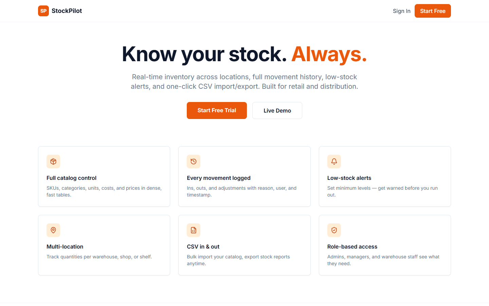
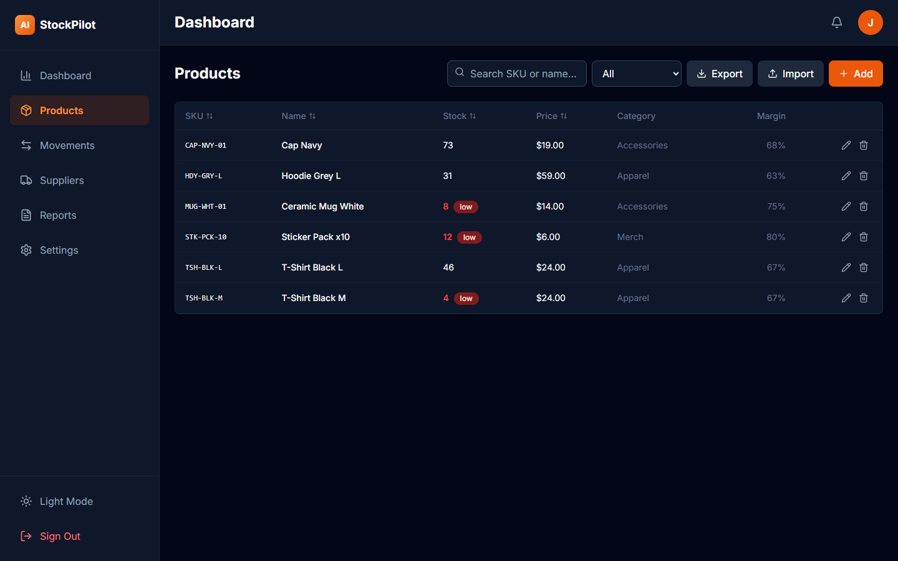
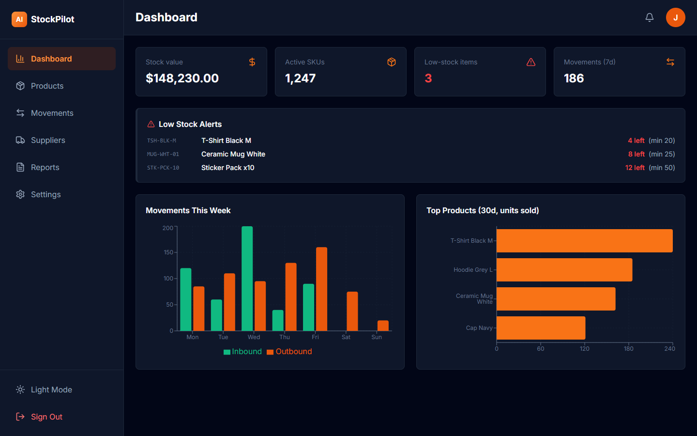
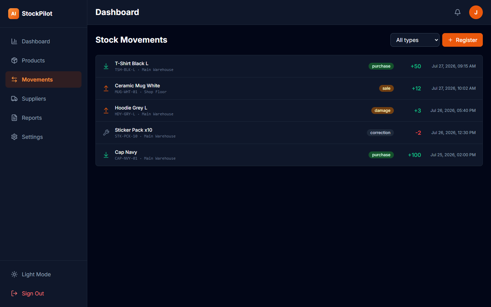

# StockPilot — Inventory Management System

Warehouse and inventory management: product catalog with SKUs, multi-location stock, full movement history, low-stock alerts, CSV import/export, and reports.

## Tech Stack
Next.js 15 (App Router), React 19, TypeScript, Tailwind CSS, Supabase (PostgreSQL + Auth + RLS), Recharts, Zod.

## Features
- 📦 Product catalog: search, category filter, column sorting, inline CRUD, margin calculation
- 🔁 Movement journal: inbound / outbound / adjustments with reasons and user attribution
- ⚠️ Low-stock alerts: min-stock thresholds surface on dashboard and in tables
- 🏬 Multi-location stock (warehouse, shop floor, ...)
- 📄 CSV export (client-side + API route `/api/products/export`)
- 📊 Reports: stock value by category, inventory turnover, dead stock, shrinkage
- 🔐 Roles: admin / manager / warehouse; RLS per organization
- ⚛️ **Transactional stock updates**: `register_movement()` PostgreSQL function inserts the movement and updates stock atomically — no drift between journal and quantities

## Quick Start
```bash
npm install
cp .env.example .env.local   # Supabase credentials
# Run sql/schema.sql in Supabase SQL editor
npm run db:seed
npm run dev
```
No external API keys needed — the app is fully functional with Supabase alone (UI pages also render with demo data before seeding).

## Demo Credentials
`demo@example.com` / `Demo123!` (create in Supabase Auth dashboard, then seed).

## Architecture Highlights
- Stock is **materialized** in the `stock` table and updated only through the `register_movement` RPC — single source of truth, atomic, auditable.
- DB-level `UNIQUE(org_id, sku)` prevents duplicate SKUs per organization.
- Dense-table UI with monospace SKUs, optimized for scanning hundreds of rows.

## Deployment
Supabase (schema + seed) → Vercel (env vars) → deploy. See [DEPLOYMENT.md](DEPLOYMENT.md).

## License
MIT

## Как пользоваться (Usage guide)



### 1. Лендинг

Обзор системы. Вход: `demo@example.com / Demo123!`.

### 2. Товары

Поиск по SKU/названию, фильтр категорий, сортировка кликом по заголовку колонки. Красный бейдж **low** — остаток ниже минимума. **Add** открывает inline-форму, **Export** скачивает CSV с остатками.

### 3. Дашборд

Стоимость склада, количество SKU и блок **Low Stock Alerts** — товары, которые пора заказывать. Графики: приход/расход за неделю и топ продаж.

### 4. Движения

Журнал каждой операции: тип (приход/списание/корректировка), причина, кто и когда. **Register** фиксирует новое движение — остаток обновится атомарно (PostgreSQL RPC).
